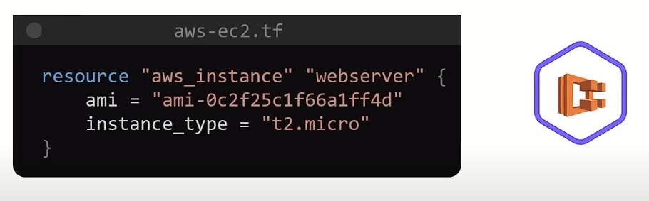
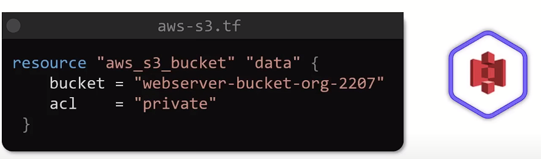
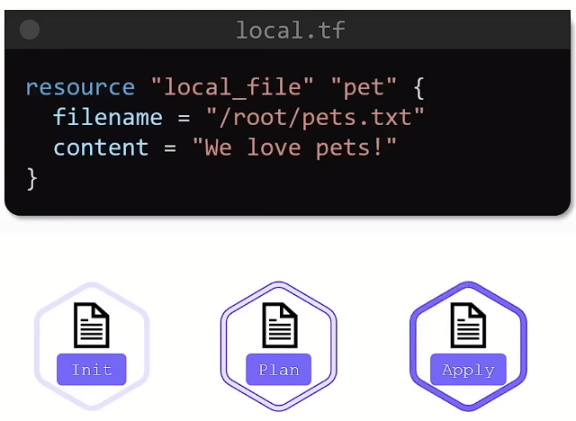

# Estudos de Terraform 

**📃 Docs:**
  + https://registry.terraform.io/providers/hashicorp/azurerm/latest/docs
  + https://developer.hashicorp.com/terraform/language/values/locals
  + https://developer.hashicorp.com/terraform/language/settings/backends/azurerm
  + https://developer.hashicorp.com/terraform/language/state/remote-state-data

## Estudos sobre Infrastructure as Code (IaC) com Terraform no Azure

**📂 1º Terraform on Azure | Udemy**
1. 'resourceGroup.tf' define um Resource Group
2. 'VNET.tf' define uma Virtual Network
3. 'subnets.tf' define duas Subnets usando o RG e a VNet criadas anteriormente
4. 'subnets-variables.tf' define as variáveis para criação das Subnets, boa prática quando se tem muitas variáveis
5. 'avset.tf' define Conjuntos de Disponibilidade
6. 'subnets.tf' possui um bloco a respeito de armazenar os arquivos que são .tfstate numa Conta de Armazenamento; em um container especifico
7. 'output.tf' define dois Outputs das subnets criadas
8. 'NIC.tf' define a Interface de Rede (network interface) usando as saídas (outputs) das subnets criadas anteriormente
9. 'VM.tf' define a criação da Virtual Machine 

## Estudos sobre Infrastructure as Code (IaC) com Terraform 

**📂 2º Terraform Tutorial for Beginners | KodeKloud**

  + Exemplo de bloco com explicação:
  

  + Exemplo de bloco com Terraform criando uma instância EC2 pra AWS:
  

  + Exemplo de bloco com Terraform criando um bucket do S3 pra AWS:
  

  + Workflow básico/inicial:
  

  