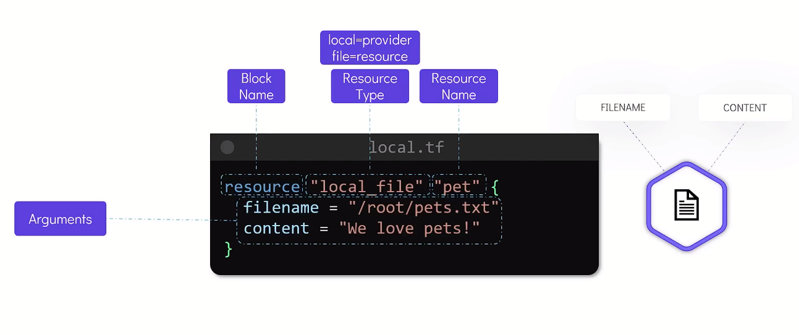
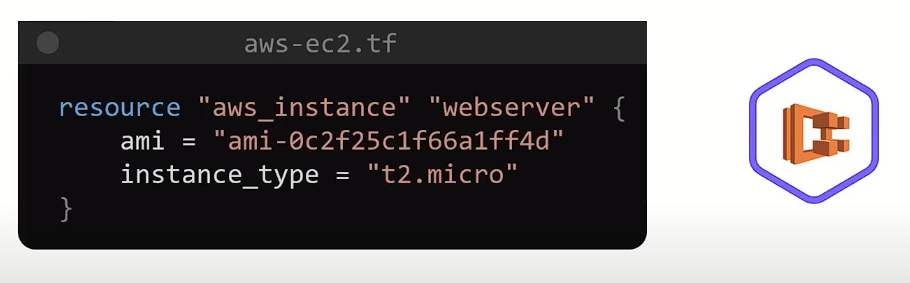
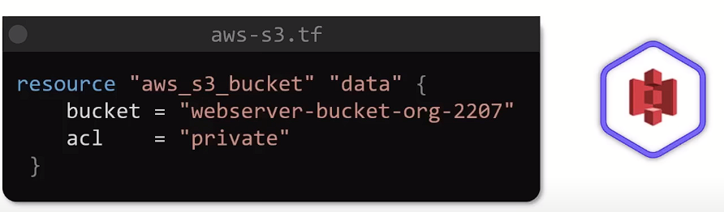
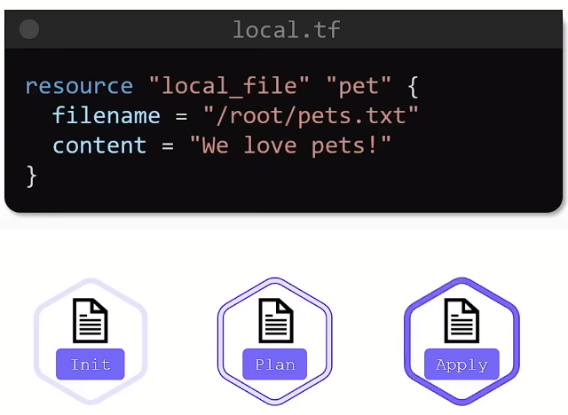
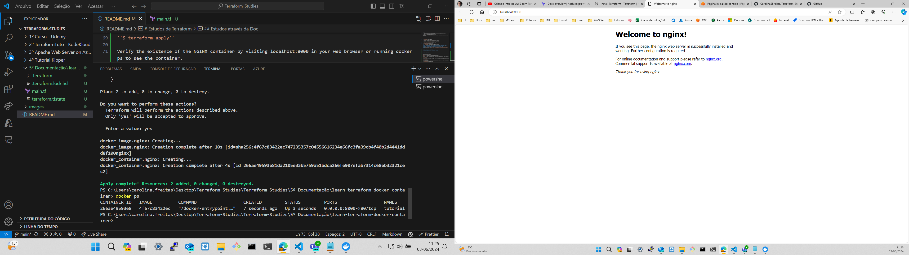
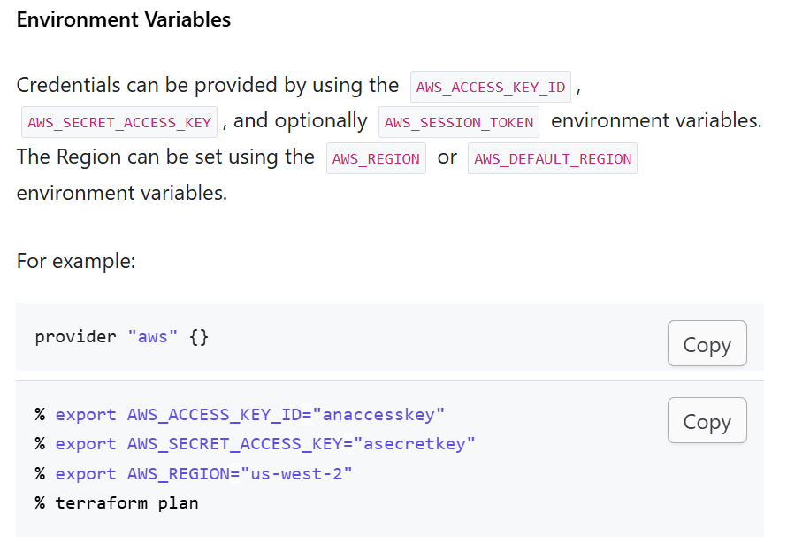

# Estudos de Terraform 

**📃 Docs:**
  + https://registry.terraform.io/providers/hashicorp/azurerm/latest/docs
  + https://developer.hashicorp.com/terraform/language/values/locals
  + https://developer.hashicorp.com/terraform/language/settings/backends/azurerm
  + https://developer.hashicorp.com/terraform/language/state/remote-state-data
  + https://registry.terraform.io/providers/hashicorp/local/latest/docs/resources/sensitive_file
  + https://medium.com/@jorge.gongora2610/how-to-set-up-an-apache-web-server-on-azure-using-terraform-f7498daa9d66

## Estudos sobre Infrastructure as Code (IaC) com Terraform no Azure

**📂 1º Terraform on Azure | Udemy**
1. 'resourceGroup.tf' define um Resource Group
2. 'VNET.tf' define uma Virtual Network
3. 'subnets.tf' define duas Subnets usando o RG e a VNet criadas anteriormente
4. 'subnets-variables.tf' define as variáveis para criação das Subnets, boa prática quando se tem muitas variáveis
5. 'avset.tf' define Conjuntos de Disponibilidade
6. 'subnets.tf' possui um bloco a respeito de armazenar os arquivos que são .tfstate numa Conta de Armazenamento; em um container especifico
7. 'output.tf' define dois Outputs das subnets criadas
8. 'NIC.tf' define a Interface de Rede (network interface) usando as saídas (outputs) das subnets criadas anteriormente
9. 'VM.tf' define a criação da Virtual Machine 

## Estudos sobre Infrastructure as Code (IaC) com Terraform 

**📂 2º Terraform Tutorial for Beginners | KodeKloud**

  + Exemplo de bloco com explicação:
  

  + Exemplo de bloco com Terraform criando uma instância EC2 pra AWS:
  

  + Exemplo de bloco com Terraform criando um bucket do S3 pra AWS:
  

  + Workflow básico/inicial:
  

  + `` terraform show `` lista os resources criados com o Terraform

## Estudos sobre Infrastructure as Code (IaC) com Terraform provisionando um server Apache no Azure

**📂 3º Artigo sobre provisionamento de Apache através do Terraform no Azure | Jorge**


- Testar o OpenSSL 

## Criando Infra na AWS com Terraform (IaC)

**📂 4º Infra na AWS com Terraform - Fernanda Kipper | YouTube**


## Estudos através da Doc

**📂 5º Estudos através da Documentação do Terraform**

### Quick Start
[Quick Start](https://developer.hashicorp.com/terraform/tutorials/aws-get-started/install-cli#quick-start-tutorial)

[main.tf](./5º Documentação/learn-terraform-docker-container/main.tf)

Initialize the project, which downloads a plugin called a provider that lets Terraform interact with Docker.

``$ terraform init``

Provision the NGINX server container with apply. When Terraform asks you to confirm type yes and press ENTER.

``$ terraform apply``

Verify the existence of the NGINX container by visiting localhost:8000 in your web browser or running docker ps to see the container.

  

To stop the container, run terraform destroy.

``$ terraform destroy``

# Build

### Get Started - AWS

[Get Started - AWS](https://developer.hashicorp.com/terraform/tutorials/aws-get-started)

**Scope:** identify the infraestructure for your project
**Author:** write configs to define your intraestructure
**Initialize:** install the required Terraform providers 
**Plan:** preview the changes Terraform will make 
**Apply:** make the planned changes to your infra

*Notes:*
*Collaborate*
*Terraform allows you to collaborate on your infrastructure with its remote state backends. When you use HCP Terraform (free for up to five users), you can securely share your state with your teammates, provide a stable environment for Terraform to run in, and prevent race conditions when multiple people make configuration changes at once.*

*You can also connect HCP Terraform to version control systems (VCSs) like GitHub, GitLab, and others, allowing it to automatically propose infrastructure changes when you commit configuration changes to VCS. This lets you manage changes to your infrastructure through version control, as you would with application code.*

**Antes de tudo, fazer o ``aws configure`` com as access keys do user (root não, cria separado)**

#### Terraform Block
The terraform {} block contains Terraform settings, including the required providers Terraform will use to provision your infrastructure. For each provider, the source attribute defines an optional hostname, a namespace, and the provider type. Terraform installs providers from the Terraform Registry by default. In this example configuration, the aws provider's source is defined as hashicorp/aws, which is shorthand for registry.terraform.io/hashicorp/aws.

You can also set a version constraint for each provider defined in the required_providers block. The version attribute is optional, but we recommend using it to constrain the provider version so that Terraform does not install a version of the provider that does not work with your configuration. If you do not specify a provider version, Terraform will automatically download the most recent version during initialization.

To learn more, reference the provider source documentation.

#### Providers
The provider block configures the specified provider, in this case aws. A provider is a plugin that Terraform uses to create and manage your resources.

[Terraform Providers](https://registry.terraform.io/browse/providers?ajs_aid=c5b86e0e-d798-4d3d-a546-e232bb791e4a&product_intent=terraform&utm_source=WEBSITE&utm_medium=WEB_IO&utm_offer=ARTICLE_PAGE&utm_content=DOCS)

You can use multiple provider blocks in your Terraform configuration to manage resources from different providers. You can even use different providers together. For example, you could pass the IP address of your AWS EC2 instance to a monitoring resource from DataDog.

#### Resources
Use resource blocks to define components of your infrastructure. A resource might be a physical or virtual component such as an EC2 instance, or it can be a logical resource such as a Heroku application.

Resource blocks have two strings before the block: the resource type and the resource name. In this example, the resource type is aws_instance and the name is app_server. The prefix of the type maps to the name of the provider. In the example configuration, Terraform manages the aws_instance resource with the aws provider. Together, the resource type and resource name form a unique ID for the resource. For example, the ID for your EC2 instance is aws_instance.app_server.

Resource blocks contain arguments which you use to configure the resource. Arguments can include things like machine sizes, disk image names, or VPC IDs. Our providers reference lists the required and optional arguments for each resource. For your EC2 instance, the example configuration sets the AMI ID to an Ubuntu image, and the instance type to t2.micro, which qualifies for AWS' free tier. It also sets a tag to give the instance a name.

## Format and validate the configuration
We recommend using consistent formatting in all of your configuration files. The terraform fmt command automatically updates configurations in the current directory for readability and consistency.

Format your configuration. Terraform will print out the names of the files it modified, if any. In this case, your configuration file was already formatted correctly, so Terraform won't return any file names.

``$ terraform fmt``

You can also make sure your configuration is syntactically valid and internally consistent by using the terraform validate command.

Validate your configuration. The example configuration provided above is valid, so Terraform will return a success message.

``$ terraform validate``

## Inspect state
When you applied your configuration, Terraform wrote data into a file called terraform.tfstate. Terraform stores the IDs and properties of the resources it manages in this file, so that it can update or destroy those resources going forward.

The Terraform state file is the only way Terraform can track which resources it manages, and often contains sensitive information, so you must store your state file securely and restrict access to only trusted team members who need to manage your infrastructure. In production, we recommend storing your state remotely with HCP Terraform or Terraform Enterprise. Terraform also supports several other remote backends you can use to store and manage your state.

Inspect the current state using  `` terraform show ``.

## Manually Managing State
Terraform has a built-in command called terraform state for advanced state management. Use the list subcommand to list of the resources in your project's state.

``terraform state list``

# Change

After changes, use `` terraform apply ``. 

On the lab, that update changes the AMI to an Ubuntu 16.04 AMI. The AWS provider knows that it cannot change the AMI of an instance after it has been created, so Terraform will destroy the old instance and create a new one.

The prefix -/+ means that Terraform will destroy and recreate the resource, rather than updating it in-place. Terraform can update some attributes in-place (indicated with the ~ prefix), but changing the AMI for an EC2 instance requires recreating it. Terraform handles these details for you, and the execution plan displays what Terraform will do.

Additionally, the execution plan shows that the AMI change is what forces Terraform to replace the instance. Using this information, you can adjust your changes to avoid destructive updates if necessary.

As indicated by the execution plan, Terraform first destroyed the existing instance and then created a new one in its place. You can use ``terraform show`` again to have Terraform print out the new values associated with this instance.

# Destroy 

The ``terraform destroy`` command terminates resources managed by your Terraform project. This command is the inverse of ``terraform apply`` in that it terminates all the resources specified in your Terraform state. **It does not destroy resources running elsewhere that are not managed by the current Terraform project.**

# Variables

Create a new file called variables.tf with a block defining a new instance_name variable.

````
variable "instance_name" {
  description = "Value of the Name tag for the EC2 instance"
  type        = string
  default     = "ExampleAppServerInstance"
}
````

**Note**
Terraform loads all files in the current directory ending in .tf, so you can name your configuration files however you choose.**

In main.tf, update the aws_instance resource block to use the new variable. The instance_name variable block will default to its default value ("ExampleAppServerInstance") unless you declare a different value.

````
 resource "aws_instance" "app_server" {
   ami           = "ami-08d70e59c07c61a3a"
   instance_type = "t2.micro"
   tags = {
-    Name = "ExampleAppServerInstance"
+    Name = var.instance_name
   }
 }
````

Apply your configuration
Apply the configuration. Respond to the confirmation prompt with a yes.

``$ terraform apply``

Now apply the configuration again, this time overriding the default instance name by passing in a variable using the -var flag. Terraform will update the instance's Name tag with the new name. Respond to the confirmation prompt with yes.

``$ terraform apply -var "instance_name=YetAnotherName"``

Setting variables via the command-line will not save their values. Terraform supports many ways to use and set variables so you can avoid having to enter them repeatedly as you execute commands. To learn more, follow our in-depth tutorial, [Customize Terraform Configuration with Variables](https://developer.hashicorp.com/terraform/tutorials/configuration-language/variables)

# Outputs

Create a file called outputs.tf in your learn-terraform-aws-instance directory.

Add the configuration below to outputs.tf to define outputs for your EC2 instance's ID and IP address.

````
output "instance_id" {
  description = "ID of the EC2 instance"
  value       = aws_instance.app_server.id
}
output "instance_public_ip" {
  description = "Public IP address of the EC2 instance"
  value       = aws_instance.app_server.public_ip
}
````

## Inspect output values
You must apply this configuration before you can use these output values. Apply your configuration now. Respond to the confirmation prompt with yes.

Terraform prints output values to the screen when you apply your configuration. Query the outputs with the terraform output command.

``$ terraform output``:
instance_id = "i-0bf954919ed765de1"
instance_public_ip = "54.186.202.254"

You can use Terraform outputs to connect your Terraform projects with other parts of your infrastructure, or with other Terraform projects. To learn more, follow our in-depth tutorial, [Output Data from Terraform.](https://developer.hashicorp.com/terraform/tutorials/configuration-language/outputs)

# Simular IAM Policies - Terraform creations

After following the [IAM policies tutorial - Terraform](https://developer.hashicorp.com/terraform/tutorials/aws/aws-iam-policy) we can test using [IAM Policy Simulator](https://policysim.aws.amazon.com/home/index.jsp)

## Estudos sobre Terraform através da Udemy

**📂 6º Terraform - Do Básico ao Avançado | Udemy**

- SAS Token: token de acesso temporário que permite acesso a um recurso específico em um armazenamento de blob
 - ``az storage blob upload -f teste.jpg --blob-url 'https://caroldatasource.blob.core.windows.net/imagens/teste.jpg?sv=<resto do token>'``

## Estudos sobre Terraform através da LinuxTips

 **📂 7º Descomplicando o Terraform | LinuxTips**
``terraform init -upgrade`` inicia e atualiza plugins
``terraform plan -out meu-plano``
``terraform plan -destroy -out destruir`` cria o plano de destruição e depois é possível aplicar
``terraform apply "destruir" | terraform apply "meu-plano"`` aplica os planos (criação ou destruição da infra)

 Autenticação AWS
